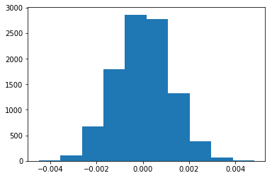

## 分析A/B测试结果

## 目录
- [简介](#intro)
- [I - 概率](#probability)
- [II - A/B 测试](#ab_test)
- [III - 回归](#regression)


<a id='intro'></a>
### 简介

对于这个项目，我们将要了解的是电子商务网站运行的 A/B 测试的结果。目标是通过这个 notebook 来帮助公司弄清楚他们是否应该使用新的页面，保留旧的页面，或者应该将测试时间延长，之后再做出决定。

<a id='probability'></a>
#### I - 概率

让我们先导入库


```python
import pandas as pd
import numpy as np
import random
import matplotlib.pyplot as plt
%matplotlib inline
#We are setting the seed to assure you get the same answers on quizzes as we set up
random.seed(42)
```

`1.` 现在，导入 `ab_data.csv` 数据，并将其存储在 `df` 中。 

a. 导入数据集，并在这里查看前几行：


```python
df = pd.read_csv('./ab-data.csv')
df.head()
```


<div>
<style scoped>
    .dataframe tbody tr th:only-of-type {
        vertical-align: middle;
    }

    .dataframe tbody tr th {
        vertical-align: top;
    }

    .dataframe thead th {
        text-align: right;
    }
</style>
<table border="1" class="dataframe">
  <thead>
    <tr style="text-align: right;">
      <th></th>
      <th>user_id</th>
      <th>timestamp</th>
      <th>group</th>
      <th>landing_page</th>
      <th>converted</th>
    </tr>
  </thead>
  <tbody>
    <tr>
      <th>0</th>
      <td>851104</td>
      <td>2017-01-21 22:11:48.556739</td>
      <td>control</td>
      <td>old_page</td>
      <td>0</td>
    </tr>
    <tr>
      <th>1</th>
      <td>804228</td>
      <td>2017-01-12 08:01:45.159739</td>
      <td>control</td>
      <td>old_page</td>
      <td>0</td>
    </tr>
    <tr>
      <th>2</th>
      <td>661590</td>
      <td>2017-01-11 16:55:06.154213</td>
      <td>treatment</td>
      <td>new_page</td>
      <td>0</td>
    </tr>
    <tr>
      <th>3</th>
      <td>853541</td>
      <td>2017-01-08 18:28:03.143765</td>
      <td>treatment</td>
      <td>new_page</td>
      <td>0</td>
    </tr>
    <tr>
      <th>4</th>
      <td>864975</td>
      <td>2017-01-21 01:52:26.210827</td>
      <td>control</td>
      <td>old_page</td>
      <td>1</td>
    </tr>
  </tbody>
</table>
</div>


b. 使用下面的单元格来查找数据集中的行数。


```python
df.shape[0]
```


    294478


c. 数据集中独立用户的数量。


```python
df.nunique()
```


    user_id         290584
    timestamp       294478
    group                2
    landing_page         2
    converted            2
    dtype: int64


独立用户数量为 290584

d. 用户转化的比例。


```python
df.query('converted == 1').user_id.nunique() / df.user_id.nunique()
```


    0.12104245244060237


e.  `new_page` 与 `treatment` 不一致的次数。


```python
df.query('group == "treatment"&landing_page == "old_page"|group == "control"&landing_page == "new_page"').shape[0]
```


    3893


f. 是否有任何行存在缺失值？


```python
sum(df.duplicated())
```


    0


`2.` 对于 **treatment** 不与 **new_page** 一致的行或 **control** 不与 **old_page** 一致的行，我们不能确定该行是否真正接收到了新的或旧的页面。我们剔除这些混乱的数据行 。

a. 现在，创建一个符合测试规格要求的新数据集。将新 dataframe 存储在 **df2** 中。


```python
df2 = df.query('group == "treatment"&landing_page == "new_page"|group == "control"&landing_page == "old_page"')
```


```python
# Double Check all of the correct rows were removed - this should be 0
df2[((df2['group'] == 'treatment') == (df2['landing_page'] == 'new_page')) == False].shape[0]
```


    0


`3.` 

a.  **df2** 中有多少唯一的 **user_id**?


```python
df2.user_id.nunique()
```


    290584


b.  **df2** 中有一个重复的 **user_id** 。它是什么？ 


```python
df2.user_id.value_counts()
```


    773192    2
    630732    1
    811737    1
    797392    1
    795345    1
    801490    1
    799443    1
    787157    1
    793302    1
    817882    1
    842446    1
    815835    1
    805596    1
    803549    1
    809694    1
    807647    1
    895712    1
    840399    1
    836301    1
    899810    1
    834242    1
    936604    1
    934557    1
    940702    1
    938655    1
    830144    1
    828097    1
    832195    1
    838348    1
    821956    1
             ..
    734668    1
    736717    1
    730574    1
    775632    1
    771538    1
    642451    1
    773587    1
    783828    1
    785877    1
    779734    1
    781783    1
    759256    1
    726472    1
    748999    1
    746950    1
    753093    1
    751044    1
    740803    1
    738754    1
    744897    1
    742848    1
    634271    1
    632222    1
    636316    1
    630169    1
    650647    1
    648598    1
    654741    1
    652692    1
    630836    1
    Name: user_id, Length: 290584, dtype: int64


```python
可见其有一个重复的 user_id 773192
```

c. 这个重复的  **user_id** 的行信息是什么？


```python
df2.query('user_id == 773192')
```


<div>
<style scoped>
    .dataframe tbody tr th:only-of-type {
        vertical-align: middle;
    }

    .dataframe tbody tr th {
        vertical-align: top;
    }

    .dataframe thead th {
        text-align: right;
    }
</style>
<table border="1" class="dataframe">
  <thead>
    <tr style="text-align: right;">
      <th></th>
      <th>user_id</th>
      <th>timestamp</th>
      <th>group</th>
      <th>landing_page</th>
      <th>converted</th>
    </tr>
  </thead>
  <tbody>
    <tr>
      <th>1899</th>
      <td>773192</td>
      <td>2017-01-09 05:37:58.781806</td>
      <td>treatment</td>
      <td>new_page</td>
      <td>0</td>
    </tr>
    <tr>
      <th>2893</th>
      <td>773192</td>
      <td>2017-01-14 02:55:59.590927</td>
      <td>treatment</td>
      <td>new_page</td>
      <td>0</td>
    </tr>
  </tbody>
</table>
</div>


d. 删除 **一个** 含有重复的 **user_id** 的行


```python
df2 = df2.drop([1899])
df2.query('user_id == 773192')
```


<div>
<style scoped>
    .dataframe tbody tr th:only-of-type {
        vertical-align: middle;
    }

    .dataframe tbody tr th {
        vertical-align: top;
    }

    .dataframe thead th {
        text-align: right;
    }
</style>
<table border="1" class="dataframe">
  <thead>
    <tr style="text-align: right;">
      <th></th>
      <th>user_id</th>
      <th>timestamp</th>
      <th>group</th>
      <th>landing_page</th>
      <th>converted</th>
    </tr>
  </thead>
  <tbody>
    <tr>
      <th>2893</th>
      <td>773192</td>
      <td>2017-01-14 02:55:59.590927</td>
      <td>treatment</td>
      <td>new_page</td>
      <td>0</td>
    </tr>
  </tbody>
</table>
</div>


`4.` 

a. 不管收到什么页面，单个用户的转化率是多少？


```python
df2.query('converted == 1').user_id.nunique() / df2.user_id.nunique()
```


    0.11959708724499628


b. 假定一个用户处于 `control` 组中，他的转化率是多少？


```python
df_control = df2.query('group == "control"')
df_control.query('converted == 1').shape[0] / df_control.shape[0]
```


    0.1203863045004612


c. 假定一个用户处于 `treatment` 组中，他的转化率是多少？


```python
df_treatment = df2.query('group == "treatment"')
df_treatment.query('converted == 1').shape[0] / df_treatment.shape[0]
```


    0.11880806551510564


d. 一个用户收到新页面的概率是多少？


```python
df_treatment.shape[0] / df2.shape[0]
```


    0.5000619442226688


e. 根据前两部分的结果，是否认为有证据表明一个页面可以带来更多的转化？

**由以上计算可见，控制组的页面转化率12.04%比实验组转化率11.88%还要高出0.16%，因此没有足够证据推翻零假设，也就不能证明新页面带来更多
转化率**

<a id='ab_test'></a>
### II - A/B 测试

`1.` 现在，我们需要根据提供的所有数据做出决定。如果假定旧的页面效果更好，除非新的页面在类型I错误率为5％的情况下才能证明效果更好，那么，零假设和备择假设可以陈述如下：


```python
零假设：新页面的效果与旧页面没有差别甚至比旧页面效果更差，即转化率 p_old >= p_new
备择假设：新页面效果比旧页面好，即 p_old < p_new
```

`2.` 假定在零假设中，不管是新页面还是旧页面， $p_{new}$ and $p_{old}$ 都具有等于 **转化** 成功率的“真”成功率，也就是说，  $p_{new}$ 与 $p_{old}$ 是相等的。此外，假设它们都等于**ab_data.csv** 中的 **转化** 率，新旧页面都是如此。  <br><br>

每个页面的样本大小要与 **ab_data.csv** 中的页面大小相同。  <br><br>

执行两次页面之间 **转化** 差异的抽样分布，计算零假设中10000次迭代计算的估计值。  <br><br>

a. 在零假设中，$p_{new}$ 的 **convert rate（转化率）** 是多少？


```python
p_new = 0.1196
```

b. 在零假设中， $p_{old}$  的 **convert rate（转化率）** 是多少？ <br><br>


```python
p_old = 0.1196
```

c.  $n_{new}$ 是多少？


```python
n_new = df_treatment.shape[0]
print(n_new)
```

    145310
    

d.  $n_{old}$?是多少？


```python
n_old = df_control.shape[0]
print(n_old)
```

    145274
    

e. 在零假设中，使用 $p_{new}$ 转化率模拟 $n_{new}$ 交易，并将这些 $n_{new}$ 1's 与 0's 存储在 **new_page_converted** 中


```python
new_page_converted = np.random.choice([0, 1], size = n_new, p = [1-p_new, p_new])
print(new_page_converted)
```

    [1 0 0 ... 1 1 0]
    

f. 在零假设中，使用 $p_{old}$ 转化率模拟 $n_{old}$ 交易，并将这些  $n_{old}$ 1's 与 0's 存储在 **old_page_converted** 中。


```python
old_page_converted = np.random.choice([0, 1], size = n_old, p = [1-p_old, p_old])
print(old_page_converted)
```

    [0 1 0 ... 0 0 1]
    

g. 在 (e) 与 (f)中找到 $p_{new}$ - $p_{old}$ 模拟值。


```python
obs_diff = new_page_converted.mean() - old_page_converted.mean()
print(obs_diff)
```

    -0.0003600375476279505
    

h. 使用**a. 到 g. ** 中的计算方法来模拟 10,000个 $p_{new}$ - $p_{old}$ 值，并将这 10,000 个值存储在 **p_diffs** 中。


```python
diffs = []
for _ in range(10000):
    new_page_converted = np.random.choice([0, 1], size = n_new, p = [1-p_new, p_new]).mean()
    old_page_converted = np.random.choice([0, 1], size = n_old, p = [1-p_old, p_old]).mean()
    diffs.append(new_page_converted - old_page_converted)
```

i. 绘制一个 **p_diffs** 直方图


```python
p_diffs = np.array(diffs)
plt.hist(p_diffs)
```


    (array([   8.,  108.,  674., 1797., 2860., 2776., 1325.,  384.,   60.,
               8.]),
     array([-0.00449629, -0.00356439, -0.00263249, -0.00170059, -0.0007687 ,
             0.0001632 ,  0.0010951 ,  0.00202699,  0.00295889,  0.00389079,
             0.00482268]),
     <a list of 10 Patch objects>)





j.  在**p_diffs**列表的数值中，有多大比例大于 **ab_data.csv** 中观察到的实际差值？


```python
(np.array(p_diffs) >  df_treatment['converted'].mean() - df_control['converted'].mean()).mean()
```


    0.9063


k. 


根据j中计算得出的p值0.9063，有 90.63% 的概率其转化率差异处于正常范围内，说明对照组和实验组的转化率差异并不明显。因此不能证明零假设是错误的，根据这个数值新页面没有更好的转化率。

l. 我们也可以使用一个内置程序 （built-in）来实现类似的结果。尽管使用内置程序可能更易于编写代码，但上面的内容是对正确思考统计显著性至关重要的思想的一个预排。填写下面的内容来计算每个页面的转化次数，以及每个页面的访问人数。使用 `n_old` 与 `n_new` 分别引证与旧页面和新页面关联的行数。


```python
import statsmodels.api as sm

convert_old = df_control['converted'].sum()
convert_new = df_treatment['converted'].sum()
n_old = df_control.shape[0]
n_new = df_treatment.shape[0]
```

m. 现在使用 `stats.proportions_ztest` 来计算你的检验统计量与 p-值。[参考链接](http://knowledgetack.com/python/statsmodels/proportions_ztest/)


```python
z_score, p_value = sm.stats.proportions_ztest([convert_new, convert_old], [n_new, n_old], alternative='larger')
print(z_score)
print(p_value)
```

    -1.3109241984234394
    0.9050583127590245
    


```python
from scipy.stats import norm

print(norm.cdf(z_score))
# Tells us how significant our z-score is

print(norm.ppf(1-0.05))
# Tells us what our critical value at 95% confidence is
```

    0.09494168724097551
    1.6448536269514722
    


```python
n. z_score的绝对值 1.3109 比计算所得的单尾临界值 1.6449 要小，因而不能推翻零假设，与j和k的结果是一致的。
```

<a id='regression'></a>
### III - 回归分析法之一

`1.` 在最后一部分中，我们之前的A / B测试中获得的结果也可以通过执行回归来获取。<br><br>

a. 既然每行的值是转化或不转化，那么在这种情况下，我们应该执行应该执行逻辑回归。

b. 目标是使用 **statsmodels** 来拟合逻辑回归模型，以查看用户收到的不同页面是否存在显著的转化差异。但是，首先，需要为这个截距创建一个列 ，并为每个用户收到的页面创建一个虚拟变量列。添加一个 **截距** 列，一个 **ab_page** 列，当用户接收 **treatment** 时为1， **control** 时为0。


```python
df3 = df2.copy()
df3['intercept'] = 1
df3[['control','treatment']] = pd.get_dummies(df3['group'])
df3.rename(columns={'treatment':'ab_page'},inplace=True)
df3.head()
```


<div>
<style scoped>
    .dataframe tbody tr th:only-of-type {
        vertical-align: middle;
    }

    .dataframe tbody tr th {
        vertical-align: top;
    }

    .dataframe thead th {
        text-align: right;
    }
</style>
<table border="1" class="dataframe">
  <thead>
    <tr style="text-align: right;">
      <th></th>
      <th>user_id</th>
      <th>timestamp</th>
      <th>group</th>
      <th>landing_page</th>
      <th>converted</th>
      <th>intercept</th>
      <th>control</th>
      <th>ab_page</th>
    </tr>
  </thead>
  <tbody>
    <tr>
      <th>0</th>
      <td>851104</td>
      <td>2017-01-21 22:11:48.556739</td>
      <td>control</td>
      <td>old_page</td>
      <td>0</td>
      <td>1</td>
      <td>1</td>
      <td>0</td>
    </tr>
    <tr>
      <th>1</th>
      <td>804228</td>
      <td>2017-01-12 08:01:45.159739</td>
      <td>control</td>
      <td>old_page</td>
      <td>0</td>
      <td>1</td>
      <td>1</td>
      <td>0</td>
    </tr>
    <tr>
      <th>2</th>
      <td>661590</td>
      <td>2017-01-11 16:55:06.154213</td>
      <td>treatment</td>
      <td>new_page</td>
      <td>0</td>
      <td>1</td>
      <td>0</td>
      <td>1</td>
    </tr>
    <tr>
      <th>3</th>
      <td>853541</td>
      <td>2017-01-08 18:28:03.143765</td>
      <td>treatment</td>
      <td>new_page</td>
      <td>0</td>
      <td>1</td>
      <td>0</td>
      <td>1</td>
    </tr>
    <tr>
      <th>4</th>
      <td>864975</td>
      <td>2017-01-21 01:52:26.210827</td>
      <td>control</td>
      <td>old_page</td>
      <td>1</td>
      <td>1</td>
      <td>1</td>
      <td>0</td>
    </tr>
  </tbody>
</table>
</div>


c. 使用 **statsmodels** 导入的回归模型。 实例化该模型，并使用在 **b.** 中创建的2个列来拟合该模型，用来预测一个用户是否会发生转化。


```python
logit_mod = sm.Logit(df3['converted'], df3[['intercept','ab_page']])
results = logit_mod.fit()
```

    Optimization terminated successfully.
             Current function value: 0.366118
             Iterations 6
    

d. 模型摘要如下：


```python
results.summary()
```


<table class="simpletable">
<caption>Logit Regression Results</caption>
<tr>
  <th>Dep. Variable:</th>     <td>converted</td>    <th>  No. Observations:  </th>   <td>290584</td>   
</tr>
<tr>
  <th>Model:</th>               <td>Logit</td>      <th>  Df Residuals:      </th>   <td>290582</td>   
</tr>
<tr>
  <th>Method:</th>               <td>MLE</td>       <th>  Df Model:          </th>   <td>     1</td>   
</tr>
<tr>
  <th>Date:</th>          <td>Fri, 07 Dec 2018</td> <th>  Pseudo R-squ.:     </th>  <td>8.077e-06</td> 
</tr>
<tr>
  <th>Time:</th>              <td>18:42:35</td>     <th>  Log-Likelihood:    </th> <td>-1.0639e+05</td>
</tr>
<tr>
  <th>converged:</th>           <td>True</td>       <th>  LL-Null:           </th> <td>-1.0639e+05</td>
</tr>
<tr>
  <th> </th>                      <td> </td>        <th>  LLR p-value:       </th>   <td>0.1899</td>   
</tr>
</table>
<table class="simpletable">
<tr>
      <td></td>         <th>coef</th>     <th>std err</th>      <th>z</th>      <th>P>|z|</th>  <th>[0.025</th>    <th>0.975]</th>  
</tr>
<tr>
  <th>intercept</th> <td>   -1.9888</td> <td>    0.008</td> <td> -246.669</td> <td> 0.000</td> <td>   -2.005</td> <td>   -1.973</td>
</tr>
<tr>
  <th>ab_page</th>   <td>   -0.0150</td> <td>    0.011</td> <td>   -1.311</td> <td> 0.190</td> <td>   -0.037</td> <td>    0.007</td>
</tr>
</table>


```python
从以上分析结果可见：与 ab_page关联的p值时 0.19，因为此回归模型的零假设是：p_old = p_new，备择假设是 p_old != p_new，是双边测验，
partII中的是单边测验，但是这里的p值已经足够大，不能推翻零假设。
```

f. 将其他因素添加到回归模型中是会带来好处，但在回归模型中添加附加项有什么弊端吗？


```python
在回归模型里面考虑更多其他因素可以减少遗漏关键影响因素的概率，从更多的维度去考察数据，提高模型的准确程度。当然也可能存在如下问题：1. 新添加的
因素与结果没有线性关系；2. 容易出现异常数据值，因为新增加的因素有可能从不同的来源收集得到，增大存在异常数据值的风险；3. 新增加的因素可能与
原有的自变量存在相关关系，有多重共线性，导致简单线性回归系数偏离我们想要的方向。
```

g. 现在，除了测试不同页面的转化率是否会发生变化之外，还要根据用户居住的国家或地区添加一个 effect 项。导入 **countries.csv** 数据集，并将数据集合并在适当的行上。 [参考链接](https://pandas.pydata.org/pandas-docs/stable/generated/pandas.DataFrame.join.html) 


```python
countries_df = pd.read_csv('./countries.csv')
countries_df.head()
```


<div>
<style scoped>
    .dataframe tbody tr th:only-of-type {
        vertical-align: middle;
    }

    .dataframe tbody tr th {
        vertical-align: top;
    }

    .dataframe thead th {
        text-align: right;
    }
</style>
<table border="1" class="dataframe">
  <thead>
    <tr style="text-align: right;">
      <th></th>
      <th>user_id</th>
      <th>country</th>
    </tr>
  </thead>
  <tbody>
    <tr>
      <th>0</th>
      <td>834778</td>
      <td>UK</td>
    </tr>
    <tr>
      <th>1</th>
      <td>928468</td>
      <td>US</td>
    </tr>
    <tr>
      <th>2</th>
      <td>822059</td>
      <td>UK</td>
    </tr>
    <tr>
      <th>3</th>
      <td>711597</td>
      <td>UK</td>
    </tr>
    <tr>
      <th>4</th>
      <td>710616</td>
      <td>UK</td>
    </tr>
  </tbody>
</table>
</div>


```python
df4 = countries_df.set_index('user_id').join(df3.set_index('user_id'), how='inner')
df4.head()
```


<div>
<style scoped>
    .dataframe tbody tr th:only-of-type {
        vertical-align: middle;
    }

    .dataframe tbody tr th {
        vertical-align: top;
    }

    .dataframe thead th {
        text-align: right;
    }
</style>
<table border="1" class="dataframe">
  <thead>
    <tr style="text-align: right;">
      <th></th>
      <th>country</th>
      <th>timestamp</th>
      <th>group</th>
      <th>landing_page</th>
      <th>converted</th>
      <th>intercept</th>
      <th>control</th>
      <th>ab_page</th>
    </tr>
    <tr>
      <th>user_id</th>
      <th></th>
      <th></th>
      <th></th>
      <th></th>
      <th></th>
      <th></th>
      <th></th>
      <th></th>
    </tr>
  </thead>
  <tbody>
    <tr>
      <th>834778</th>
      <td>UK</td>
      <td>2017-01-14 23:08:43.304998</td>
      <td>control</td>
      <td>old_page</td>
      <td>0</td>
      <td>1</td>
      <td>1</td>
      <td>0</td>
    </tr>
    <tr>
      <th>928468</th>
      <td>US</td>
      <td>2017-01-23 14:44:16.387854</td>
      <td>treatment</td>
      <td>new_page</td>
      <td>0</td>
      <td>1</td>
      <td>0</td>
      <td>1</td>
    </tr>
    <tr>
      <th>822059</th>
      <td>UK</td>
      <td>2017-01-16 14:04:14.719771</td>
      <td>treatment</td>
      <td>new_page</td>
      <td>1</td>
      <td>1</td>
      <td>0</td>
      <td>1</td>
    </tr>
    <tr>
      <th>711597</th>
      <td>UK</td>
      <td>2017-01-22 03:14:24.763511</td>
      <td>control</td>
      <td>old_page</td>
      <td>0</td>
      <td>1</td>
      <td>1</td>
      <td>0</td>
    </tr>
    <tr>
      <th>710616</th>
      <td>UK</td>
      <td>2017-01-16 13:14:44.000513</td>
      <td>treatment</td>
      <td>new_page</td>
      <td>0</td>
      <td>1</td>
      <td>0</td>
      <td>1</td>
    </tr>
  </tbody>
</table>
</div>


```python
df4[['CA','UK']] = pd.get_dummies(df4['country'])[['CA',"UK"]]
df4['intercept'] = 1
lm = sm.Logit(df4['converted'], df4[['intercept','CA','UK','ab_page']] ) 
results = lm.fit()
results.summary()
```

    Optimization terminated successfully.
             Current function value: 0.366113
             Iterations 6
    


<table class="simpletable">
<caption>Logit Regression Results</caption>
<tr>
  <th>Dep. Variable:</th>     <td>converted</td>    <th>  No. Observations:  </th>   <td>290584</td>   
</tr>
<tr>
  <th>Model:</th>               <td>Logit</td>      <th>  Df Residuals:      </th>   <td>290580</td>   
</tr>
<tr>
  <th>Method:</th>               <td>MLE</td>       <th>  Df Model:          </th>   <td>     3</td>   
</tr>
<tr>
  <th>Date:</th>          <td>Sun, 09 Dec 2018</td> <th>  Pseudo R-squ.:     </th>  <td>2.323e-05</td> 
</tr>
<tr>
  <th>Time:</th>              <td>01:39:36</td>     <th>  Log-Likelihood:    </th> <td>-1.0639e+05</td>
</tr>
<tr>
  <th>converged:</th>           <td>True</td>       <th>  LL-Null:           </th> <td>-1.0639e+05</td>
</tr>
<tr>
  <th> </th>                      <td> </td>        <th>  LLR p-value:       </th>   <td>0.1760</td>   
</tr>
</table>
<table class="simpletable">
<tr>
      <td></td>         <th>coef</th>     <th>std err</th>      <th>z</th>      <th>P>|z|</th>  <th>[0.025</th>    <th>0.975]</th>  
</tr>
<tr>
  <th>intercept</th> <td>   -1.9893</td> <td>    0.009</td> <td> -223.763</td> <td> 0.000</td> <td>   -2.007</td> <td>   -1.972</td>
</tr>
<tr>
  <th>CA</th>        <td>   -0.0408</td> <td>    0.027</td> <td>   -1.516</td> <td> 0.130</td> <td>   -0.093</td> <td>    0.012</td>
</tr>
<tr>
  <th>UK</th>        <td>    0.0099</td> <td>    0.013</td> <td>    0.743</td> <td> 0.457</td> <td>   -0.016</td> <td>    0.036</td>
</tr>
<tr>
  <th>ab_page</th>   <td>   -0.0149</td> <td>    0.011</td> <td>   -1.307</td> <td> 0.191</td> <td>   -0.037</td> <td>    0.007</td>
</tr>
</table>


```python
(1/np.exp(-0.0408), np.exp(0.0099))
```


    (1.0416437559600236, 1.0099491671175422)


```python
根据上面的模型结果中 CA 和 UK 的p值，并不能推翻零假设，没有证据证明新页面带来显著转化率。同时对其解析系数分析结果同证。
```

h. 虽然现在已经查看了国家与页面在转化率上的个体性因素，但现在我们要查看页面与国家/地区之间的相互作用，测试其是否会对转化产生重大影响。创建必要的附加列，并拟合一个新的模型。  


```python
df4['new_CA'] = df4['ab_page']*df4['CA']
df4['new_UK'] = df4['ab_page']*df4['UK']
df4['intercept'] = 1
lm_new = sm.Logit(df4['converted'], df4[['intercept', 'ab_page', 'CA', 'new_CA', 'UK', 'new_UK']] ) 
results_new = lm_new.fit()
results_new.summary()
```

    Optimization terminated successfully.
             Current function value: 0.366109
             Iterations 6
    


<table class="simpletable">
<caption>Logit Regression Results</caption>
<tr>
  <th>Dep. Variable:</th>     <td>converted</td>    <th>  No. Observations:  </th>   <td>290584</td>   
</tr>
<tr>
  <th>Model:</th>               <td>Logit</td>      <th>  Df Residuals:      </th>   <td>290578</td>   
</tr>
<tr>
  <th>Method:</th>               <td>MLE</td>       <th>  Df Model:          </th>   <td>     5</td>   
</tr>
<tr>
  <th>Date:</th>          <td>Sun, 09 Dec 2018</td> <th>  Pseudo R-squ.:     </th>  <td>3.482e-05</td> 
</tr>
<tr>
  <th>Time:</th>              <td>01:41:14</td>     <th>  Log-Likelihood:    </th> <td>-1.0639e+05</td>
</tr>
<tr>
  <th>converged:</th>           <td>True</td>       <th>  LL-Null:           </th> <td>-1.0639e+05</td>
</tr>
<tr>
  <th> </th>                      <td> </td>        <th>  LLR p-value:       </th>   <td>0.1920</td>   
</tr>
</table>
<table class="simpletable">
<tr>
      <td></td>         <th>coef</th>     <th>std err</th>      <th>z</th>      <th>P>|z|</th>  <th>[0.025</th>    <th>0.975]</th>  
</tr>
<tr>
  <th>intercept</th> <td>   -1.9865</td> <td>    0.010</td> <td> -206.344</td> <td> 0.000</td> <td>   -2.005</td> <td>   -1.968</td>
</tr>
<tr>
  <th>ab_page</th>   <td>   -0.0206</td> <td>    0.014</td> <td>   -1.505</td> <td> 0.132</td> <td>   -0.047</td> <td>    0.006</td>
</tr>
<tr>
  <th>CA</th>        <td>   -0.0175</td> <td>    0.038</td> <td>   -0.465</td> <td> 0.642</td> <td>   -0.091</td> <td>    0.056</td>
</tr>
<tr>
  <th>new_CA</th>    <td>   -0.0469</td> <td>    0.054</td> <td>   -0.872</td> <td> 0.383</td> <td>   -0.152</td> <td>    0.059</td>
</tr>
<tr>
  <th>UK</th>        <td>   -0.0057</td> <td>    0.019</td> <td>   -0.306</td> <td> 0.760</td> <td>   -0.043</td> <td>    0.031</td>
</tr>
<tr>
  <th>new_UK</th>    <td>    0.0314</td> <td>    0.027</td> <td>    1.181</td> <td> 0.238</td> <td>   -0.021</td> <td>    0.084</td>
</tr>
</table>


```python
为了查看页面与国家/地区之间的相互作用，往模型添加了页面和国家/地区的交叉项，根据模型结果可见其对页面转化率并无显著的影响。
```

<a id='conclusions'></a>
## 总结
(1) 根据A/B测试和逻辑回归模型验证，无法推翻零假设，可以认为新页面并没有带来更多的转化率，旧页面的转化率甚至要稍微好于新页面。
(2) 国家地区对页面转化率并无显著的影响。
(3) 既然不能证明新页面能够带来更多转化率，并不推荐这家电商发布新页面。
### 参考资料
* [numpy.random.choice](https://docs.scipy.org/doc/numpy/reference/generated/numpy.random.choice.html)
* [proportions_ztest](http://knowledgetack.com/python/statsmodels/proportions_ztest/)
* [dataFrame 聚合](https://pandas.pydata.org/pandas-docs/stable/generated/pandas.DataFrame.join.html)
* udacity 课程资料


```python

```
