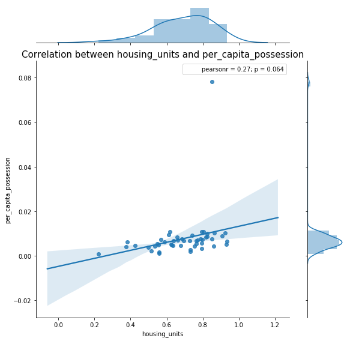
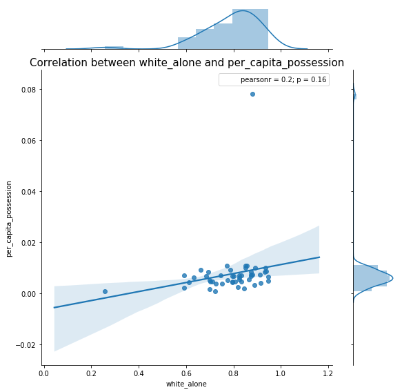
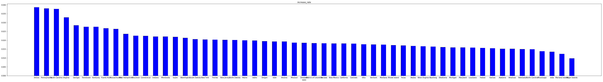
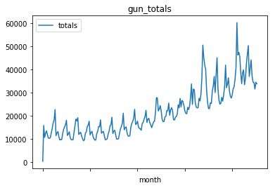

# 项目：FBI枪支数据探索

## 目录
<ul>
<li><a href="#intro">提出问题</a></li>
<li><a href="#wrangling">数据整理</a></li>
<li><a href="#eda">探索性数据分析</a></li>
<li><a href="#conclusions">结论</a></li>
<li><a href="#reference">参考资料</a></li>
</ul>

<a id="intro"></a>
## 1 提出问题

   本项目探索的数据集来源于联邦调查局 (FBI) 的全国即时犯罪背景调查系统 (NICS)，该数据包含了按照月份、州 、类型统计的武器调查数量，并且为了探索枪支数据与人口统计数据间的关系，本项目还采用了美国的一份人口普查数据。
   根据所拥有的数据，提出以下待探索的问题：
   1. 哪些州的人均枪支拥有量最高？
   2. 哪些人口统计数据和枪支人均拥有量具有比较高的相关性？
   3. 哪些州的枪支数量增长率最高？
   4. 枪支的购买的趋势是怎样的？      

<a id="wrangling"></a>
## 2 数据整理

### 2.1 导入枪支数据并整理


```python
#导入基本库
import pandas as pd
import numpy as np
import matplotlib.pyplot as plt
% matplotlib inline
import seaborn as sns
import scipy.stats as sci
import warnings
warnings.filterwarnings("ignore")
```


```python
#导入枪支数据，查看数据集基本信息
df = pd.read_csv('./gun_data.csv')
df.info()
```

    <class 'pandas.core.frame.DataFrame'>
    RangeIndex: 12485 entries, 0 to 12484
    Data columns (total 27 columns):
    month                        12485 non-null object
    state                        12485 non-null object
    permit                       12461 non-null float64
    permit_recheck               1100 non-null float64
    handgun                      12465 non-null float64
    long_gun                     12466 non-null float64
    other                        5500 non-null float64
    multiple                     12485 non-null int64
    admin                        12462 non-null float64
    prepawn_handgun              10542 non-null float64
    prepawn_long_gun             10540 non-null float64
    prepawn_other                5115 non-null float64
    redemption_handgun           10545 non-null float64
    redemption_long_gun          10544 non-null float64
    redemption_other             5115 non-null float64
    returned_handgun             2200 non-null float64
    returned_long_gun            2145 non-null float64
    returned_other               1815 non-null float64
    rentals_handgun              990 non-null float64
    rentals_long_gun             825 non-null float64
    private_sale_handgun         2750 non-null float64
    private_sale_long_gun        2750 non-null float64
    private_sale_other           2750 non-null float64
    return_to_seller_handgun     2475 non-null float64
    return_to_seller_long_gun    2750 non-null float64
    return_to_seller_other       2255 non-null float64
    totals                       12485 non-null int64
    dtypes: float64(23), int64(2), object(2)
    memory usage: 2.6+ MB
    

由以上信息可见该数据共有27个字段值，我们主要关注的是：state:州，month：月份，totals：枪支总数。除了state，month和totals之外其他的各个类型的枪支字段数据均有缺失值，而且缺失量比较大，为了确定这些缺失值对本项目分析的影响大小，查看一下月份的范围：


```python
df['month'].unique()
```


    array(['2017-09', '2017-08', '2017-07', '2017-06', '2017-05', '2017-04',
           '2017-03', '2017-02', '2017-01', '2016-12', '2016-11', '2016-10',
           '2016-09', '2016-08', '2016-07', '2016-06', '2016-05', '2016-04',
           '2016-03', '2016-02', '2016-01', '2015-12', '2015-11', '2015-10',
           '2015-09', '2015-08', '2015-07', '2015-06', '2015-05', '2015-04',
           '2015-03', '2015-02', '2015-01', '2014-12', '2014-11', '2014-10',
           '2014-09', '2014-08', '2014-07', '2014-06', '2014-05', '2014-04',
           '2014-03', '2014-02', '2014-01', '2013-12', '2013-11', '2013-10',
           '2013-09', '2013-08', '2013-07', '2013-06', '2013-05', '2013-04',
           '2013-03', '2013-02', '2013-01', '2012-12', '2012-11', '2012-10',
           '2012-09', '2012-08', '2012-07', '2012-06', '2012-05', '2012-04',
           '2012-03', '2012-02', '2012-01', '2011-12', '2011-11', '2011-10',
           '2011-09', '2011-08', '2011-07', '2011-06', '2011-05', '2011-04',
           '2011-03', '2011-02', '2011-01', '2010-12', '2010-11', '2010-10',
           '2010-09', '2010-08', '2010-07', '2010-06', '2010-05', '2010-04',
           '2010-03', '2010-02', '2010-01', '2009-12', '2009-11', '2009-10',
           '2009-09', '2009-08', '2009-07', '2009-06', '2009-05', '2009-04',
           '2009-03', '2009-02', '2009-01', '2008-12', '2008-11', '2008-10',
           '2008-09', '2008-08', '2008-07', '2008-06', '2008-05', '2008-04',
           '2008-03', '2008-02', '2008-01', '2007-12', '2007-11', '2007-10',
           '2007-09', '2007-08', '2007-07', '2007-06', '2007-05', '2007-04',
           '2007-03', '2007-02', '2007-01', '2006-12', '2006-11', '2006-10',
           '2006-09', '2006-08', '2006-07', '2006-06', '2006-05', '2006-04',
           '2006-03', '2006-02', '2006-01', '2005-12', '2005-11', '2005-10',
           '2005-09', '2005-08', '2005-07', '2005-06', '2005-05', '2005-04',
           '2005-03', '2005-02', '2005-01', '2004-12', '2004-11', '2004-10',
           '2004-09', '2004-08', '2004-07', '2004-06', '2004-05', '2004-04',
           '2004-03', '2004-02', '2004-01', '2003-12', '2003-11', '2003-10',
           '2003-09', '2003-08', '2003-07', '2003-06', '2003-05', '2003-04',
           '2003-03', '2003-02', '2003-01', '2002-12', '2002-11', '2002-10',
           '2002-09', '2002-08', '2002-07', '2002-06', '2002-05', '2002-04',
           '2002-03', '2002-02', '2002-01', '2001-12', '2001-11', '2001-10',
           '2001-09', '2001-08', '2001-07', '2001-06', '2001-05', '2001-04',
           '2001-03', '2001-02', '2001-01', '2000-12', '2000-11', '2000-10',
           '2000-09', '2000-08', '2000-07', '2000-06', '2000-05', '2000-04',
           '2000-03', '2000-02', '2000-01', '1999-12', '1999-11', '1999-10',
           '1999-09', '1999-08', '1999-07', '1999-06', '1999-05', '1999-04',
           '1999-03', '1999-02', '1999-01', '1998-12', '1998-11'],
          dtype=object)


可见月份范围为1998年11月到2017年9月，将近20年，对于本文提出的问题1和问题2，与数据时间周期关系不大，可考虑尽量取最近的的无缺失值的数据，至于问题3和问题4要探索增长率和购买趋势，就需要长周期的数据量，因此对于问题1和2处理直接删除具有缺失值的行。


```python
#删除具有缺失值的行，另存为df1
df1 = df.dropna()
#仅保留state month totals列
columns = ['state', 'month', 'totals']
drop_columnes = []
for col in df1.columns.values:
    if col not in columns:
        drop_columnes.append(col)
df1 = df1.drop(drop_columnes,  axis=1)
df1.info()
```

    <class 'pandas.core.frame.DataFrame'>
    Int64Index: 770 entries, 0 to 769
    Data columns (total 3 columns):
    month     770 non-null object
    state     770 non-null object
    totals    770 non-null int64
    dtypes: int64(1), object(2)
    memory usage: 24.1+ KB
    

### 2.2 导入人口普查数据并整理


```python
#导入人口数据
df_pop = pd.read_csv('./us_data.csv')
df_pop.info()
```

    <class 'pandas.core.frame.DataFrame'>
    RangeIndex: 85 entries, 0 to 84
    Data columns (total 52 columns):
    Fact              80 non-null object
    Fact Note         28 non-null object
    Alabama           65 non-null object
    Alaska            65 non-null object
    Arizona           65 non-null object
    Arkansas          65 non-null object
    California        65 non-null object
    Colorado          65 non-null object
    Connecticut       65 non-null object
    Delaware          65 non-null object
    Florida           65 non-null object
    Georgia           65 non-null object
    Hawaii            65 non-null object
    Idaho             65 non-null object
    Illinois          65 non-null object
    Indiana           65 non-null object
    Iowa              65 non-null object
    Kansas            65 non-null object
    Kentucky          65 non-null object
    Louisiana         65 non-null object
    Maine             65 non-null object
    Maryland          65 non-null object
    Massachusetts     65 non-null object
    Michigan          65 non-null object
    Minnesota         65 non-null object
    Mississippi       65 non-null object
    Missouri          65 non-null object
    Montana           65 non-null object
    Nebraska          65 non-null object
    Nevada            65 non-null object
    New Hampshire     65 non-null object
    New Jersey        65 non-null object
    New Mexico        65 non-null object
    New York          65 non-null object
    North Carolina    65 non-null object
    North Dakota      65 non-null object
    Ohio              65 non-null object
    Oklahoma          65 non-null object
    Oregon            65 non-null object
    Pennsylvania      65 non-null object
    Rhode Island      65 non-null object
    South Carolina    65 non-null object
    South Dakota      65 non-null object
    Tennessee         65 non-null object
    Texas             65 non-null object
    Utah              65 non-null object
    Vermont           65 non-null object
    Virginia          65 non-null object
    Washington        65 non-null object
    West Virginia     65 non-null object
    Wisconsin         65 non-null object
    Wyoming           65 non-null object
    dtypes: object(52)
    memory usage: 34.6+ KB
    


```python
#Fact为人口变量说明，首先查看一下都有哪些人口变量值，再行决定获取哪些有用的变量值：
df_pop['Fact']
```


    0          Population estimates, July 1, 2016,  (V2016)
    1     Population estimates base, April 1, 2010,  (V2...
    2     Population, percent change - April 1, 2010 (es...
    3                     Population, Census, April 1, 2010
    4     Persons under 5 years, percent, July 1, 2016, ...
    5         Persons under 5 years, percent, April 1, 2010
    6     Persons under 18 years, percent, July 1, 2016,...
    7        Persons under 18 years, percent, April 1, 2010
    8     Persons 65 years and over, percent,  July 1, 2...
    9     Persons 65 years and over, percent, April 1, 2010
    10     Female persons, percent,  July 1, 2016,  (V2016)
    11               Female persons, percent, April 1, 2010
    12         White alone, percent, July 1, 2016,  (V2016)
    13    Black or African American alone, percent, July...
    14    American Indian and Alaska Native alone, perce...
    15         Asian alone, percent, July 1, 2016,  (V2016)
    16    Native Hawaiian and Other Pacific Islander alo...
    17    Two or More Races, percent, July 1, 2016,  (V2...
    18    Hispanic or Latino, percent, July 1, 2016,  (V...
    19    White alone, not Hispanic or Latino, percent, ...
    20                                  Veterans, 2011-2015
    21             Foreign born persons, percent, 2011-2015
    22               Housing units,  July 1, 2016,  (V2016)
    23                         Housing units, April 1, 2010
    24          Owner-occupied housing unit rate, 2011-2015
    25    Median value of owner-occupied housing units, ...
    26    Median selected monthly owner costs -with a mo...
    27    Median selected monthly owner costs -without a...
    28                         Median gross rent, 2011-2015
    29                               Building permits, 2016
                                ...                        
    55                                      All firms, 2012
    56                                Men-owned firms, 2012
    57                              Women-owned firms, 2012
    58                           Minority-owned firms, 2012
    59                        Nonminority-owned firms, 2012
    60                            Veteran-owned firms, 2012
    61                         Nonveteran-owned firms, 2012
    62                     Population per square mile, 2010
    63                      Land area in square miles, 2010
    64                                            FIPS Code
    65                                                  NaN
    66    NOTE: FIPS Code values are enclosed in quotes ...
    67                                                  NaN
    68                                          Value Notes
    69                                                    1
    70                                                  NaN
    71                                           Fact Notes
    72                                                  (a)
    73                                                  (b)
    74                                                  (c)
    75                                                  NaN
    76                                          Value Flags
    77                                                    -
    78                                                    D
    79                                                    F
    80                                                   FN
    81                                                  NaN
    82                                                    S
    83                                                    X
    84                                                    Z
    Name: Fact, Length: 85, dtype: object


在众多的人口变量中，这里我们选取了人口总数量，人口年龄段，人口种族和住宅拥有量这几个变量：


```python
#获取对于分析枪支数据有需要的变量
df_pop = df_pop.iloc[np.r_[0, 4, 6, 8, 10, 12, 13, 14, 15, 16, 17, 18, 19, 22], np.r_[0, 2:51]]
df_pop = df_pop.set_index(['Fact'])
df_pop
```


<div>
<style scoped>
    .dataframe tbody tr th:only-of-type {
        vertical-align: middle;
    }

    .dataframe tbody tr th {
        vertical-align: top;
    }

    .dataframe thead th {
        text-align: right;
    }
</style>
<table border="1" class="dataframe">
  <thead>
    <tr style="text-align: right;">
      <th></th>
      <th>Alabama</th>
      <th>Alaska</th>
      <th>Arizona</th>
      <th>Arkansas</th>
      <th>California</th>
      <th>Colorado</th>
      <th>Connecticut</th>
      <th>Delaware</th>
      <th>Florida</th>
      <th>Georgia</th>
      <th>...</th>
      <th>South Carolina</th>
      <th>South Dakota</th>
      <th>Tennessee</th>
      <th>Texas</th>
      <th>Utah</th>
      <th>Vermont</th>
      <th>Virginia</th>
      <th>Washington</th>
      <th>West Virginia</th>
      <th>Wisconsin</th>
    </tr>
    <tr>
      <th>Fact</th>
      <th></th>
      <th></th>
      <th></th>
      <th></th>
      <th></th>
      <th></th>
      <th></th>
      <th></th>
      <th></th>
      <th></th>
      <th></th>
      <th></th>
      <th></th>
      <th></th>
      <th></th>
      <th></th>
      <th></th>
      <th></th>
      <th></th>
      <th></th>
      <th></th>
    </tr>
  </thead>
  <tbody>
    <tr>
      <th>Population estimates, July 1, 2016,  (V2016)</th>
      <td>4,863,300</td>
      <td>741,894</td>
      <td>6,931,071</td>
      <td>2,988,248</td>
      <td>39,250,017</td>
      <td>5,540,545</td>
      <td>3,576,452</td>
      <td>952,065</td>
      <td>20,612,439</td>
      <td>10,310,371</td>
      <td>...</td>
      <td>4961119</td>
      <td>865454</td>
      <td>6651194</td>
      <td>27,862,596</td>
      <td>3,051,217</td>
      <td>624,594</td>
      <td>8,411,808</td>
      <td>7,288,000</td>
      <td>1,831,102</td>
      <td>5,778,708</td>
    </tr>
    <tr>
      <th>Persons under 5 years, percent, July 1, 2016,  (V2016)</th>
      <td>6.00%</td>
      <td>7.30%</td>
      <td>6.30%</td>
      <td>6.40%</td>
      <td>6.30%</td>
      <td>6.10%</td>
      <td>5.20%</td>
      <td>5.80%</td>
      <td>5.50%</td>
      <td>6.40%</td>
      <td>...</td>
      <td>0.059</td>
      <td>0.071</td>
      <td>0.061</td>
      <td>7.20%</td>
      <td>8.30%</td>
      <td>4.90%</td>
      <td>6.10%</td>
      <td>6.20%</td>
      <td>5.50%</td>
      <td>5.80%</td>
    </tr>
    <tr>
      <th>Persons under 18 years, percent, July 1, 2016,  (V2016)</th>
      <td>22.60%</td>
      <td>25.20%</td>
      <td>23.50%</td>
      <td>23.60%</td>
      <td>23.20%</td>
      <td>22.80%</td>
      <td>21.10%</td>
      <td>21.50%</td>
      <td>20.10%</td>
      <td>24.40%</td>
      <td>...</td>
      <td>0.221</td>
      <td>0.246</td>
      <td>0.226</td>
      <td>26.20%</td>
      <td>30.20%</td>
      <td>19.00%</td>
      <td>22.20%</td>
      <td>22.40%</td>
      <td>20.50%</td>
      <td>22.30%</td>
    </tr>
    <tr>
      <th>Persons 65 years and over, percent,  July 1, 2016,  (V2016)</th>
      <td>16.10%</td>
      <td>10.40%</td>
      <td>16.90%</td>
      <td>16.30%</td>
      <td>13.60%</td>
      <td>13.40%</td>
      <td>16.10%</td>
      <td>17.50%</td>
      <td>19.90%</td>
      <td>13.10%</td>
      <td>...</td>
      <td>0.167</td>
      <td>0.16</td>
      <td>0.157</td>
      <td>12.00%</td>
      <td>10.50%</td>
      <td>18.10%</td>
      <td>14.60%</td>
      <td>14.80%</td>
      <td>18.80%</td>
      <td>16.10%</td>
    </tr>
    <tr>
      <th>Female persons, percent,  July 1, 2016,  (V2016)</th>
      <td>51.60%</td>
      <td>47.70%</td>
      <td>50.30%</td>
      <td>50.90%</td>
      <td>50.30%</td>
      <td>49.70%</td>
      <td>51.20%</td>
      <td>51.60%</td>
      <td>51.10%</td>
      <td>51.30%</td>
      <td>...</td>
      <td>0.515</td>
      <td>0.496</td>
      <td>0.512</td>
      <td>50.40%</td>
      <td>49.70%</td>
      <td>50.60%</td>
      <td>50.80%</td>
      <td>50.00%</td>
      <td>50.50%</td>
      <td>50.30%</td>
    </tr>
    <tr>
      <th>White alone, percent, July 1, 2016,  (V2016)</th>
      <td>69.30%</td>
      <td>66.10%</td>
      <td>83.30%</td>
      <td>79.40%</td>
      <td>72.70%</td>
      <td>87.50%</td>
      <td>80.60%</td>
      <td>70.10%</td>
      <td>77.60%</td>
      <td>61.20%</td>
      <td>...</td>
      <td>0.685</td>
      <td>0.852</td>
      <td>0.787</td>
      <td>79.40%</td>
      <td>91.10%</td>
      <td>94.60%</td>
      <td>70.00%</td>
      <td>80.00%</td>
      <td>93.60%</td>
      <td>87.50%</td>
    </tr>
    <tr>
      <th>Black or African American alone, percent, July 1, 2016,  (V2016)</th>
      <td>26.80%</td>
      <td>3.80%</td>
      <td>4.90%</td>
      <td>15.70%</td>
      <td>6.50%</td>
      <td>4.50%</td>
      <td>11.80%</td>
      <td>22.60%</td>
      <td>16.80%</td>
      <td>32.00%</td>
      <td>...</td>
      <td>0.275</td>
      <td>0.02</td>
      <td>0.171</td>
      <td>12.60%</td>
      <td>1.40%</td>
      <td>1.30%</td>
      <td>19.80%</td>
      <td>4.10%</td>
      <td>3.60%</td>
      <td>6.60%</td>
    </tr>
    <tr>
      <th>American Indian and Alaska Native alone, percent, July 1, 2016,  (V2016)</th>
      <td>0.70%</td>
      <td>15.20%</td>
      <td>5.40%</td>
      <td>1.00%</td>
      <td>1.70%</td>
      <td>1.60%</td>
      <td>0.50%</td>
      <td>0.60%</td>
      <td>0.50%</td>
      <td>0.50%</td>
      <td>...</td>
      <td>0.005</td>
      <td>0.09</td>
      <td>0.004</td>
      <td>1.00%</td>
      <td>1.60%</td>
      <td>0.40%</td>
      <td>0.50%</td>
      <td>1.90%</td>
      <td>0.20%</td>
      <td>1.10%</td>
    </tr>
    <tr>
      <th>Asian alone, percent, July 1, 2016,  (V2016)</th>
      <td>1.40%</td>
      <td>6.30%</td>
      <td>3.40%</td>
      <td>1.60%</td>
      <td>14.80%</td>
      <td>3.30%</td>
      <td>4.70%</td>
      <td>4.00%</td>
      <td>2.90%</td>
      <td>4.10%</td>
      <td>...</td>
      <td>0.016</td>
      <td>0.015</td>
      <td>0.018</td>
      <td>4.80%</td>
      <td>2.50%</td>
      <td>1.80%</td>
      <td>6.60%</td>
      <td>8.60%</td>
      <td>0.80%</td>
      <td>2.80%</td>
    </tr>
    <tr>
      <th>Native Hawaiian and Other Pacific Islander alone, percent, July 1, 2016,  (V2016)</th>
      <td>0.10%</td>
      <td>1.30%</td>
      <td>0.30%</td>
      <td>0.30%</td>
      <td>0.50%</td>
      <td>0.20%</td>
      <td>0.10%</td>
      <td>0.10%</td>
      <td>0.10%</td>
      <td>0.10%</td>
      <td>...</td>
      <td>0.001</td>
      <td>0.001</td>
      <td>0.001</td>
      <td>0.10%</td>
      <td>1.00%</td>
      <td>Z</td>
      <td>0.10%</td>
      <td>0.80%</td>
      <td>Z</td>
      <td>0.10%</td>
    </tr>
    <tr>
      <th>Two or More Races, percent, July 1, 2016,  (V2016)</th>
      <td>1.60%</td>
      <td>7.30%</td>
      <td>2.80%</td>
      <td>2.00%</td>
      <td>3.80%</td>
      <td>3.00%</td>
      <td>2.30%</td>
      <td>2.60%</td>
      <td>2.10%</td>
      <td>2.10%</td>
      <td>...</td>
      <td>0.018</td>
      <td>0.023</td>
      <td>0.019</td>
      <td>1.90%</td>
      <td>2.50%</td>
      <td>1.90%</td>
      <td>2.90%</td>
      <td>4.60%</td>
      <td>1.70%</td>
      <td>1.90%</td>
    </tr>
    <tr>
      <th>Hispanic or Latino, percent, July 1, 2016,  (V2016)</th>
      <td>4.20%</td>
      <td>7.00%</td>
      <td>30.90%</td>
      <td>7.30%</td>
      <td>38.90%</td>
      <td>21.30%</td>
      <td>15.70%</td>
      <td>9.20%</td>
      <td>24.90%</td>
      <td>9.40%</td>
      <td>...</td>
      <td>0.055</td>
      <td>0.037</td>
      <td>0.052</td>
      <td>39.10%</td>
      <td>13.80%</td>
      <td>1.90%</td>
      <td>9.10%</td>
      <td>12.40%</td>
      <td>1.50%</td>
      <td>6.70%</td>
    </tr>
    <tr>
      <th>White alone, not Hispanic or Latino, percent, July 1, 2016,  (V2016)</th>
      <td>65.80%</td>
      <td>61.20%</td>
      <td>55.50%</td>
      <td>72.90%</td>
      <td>37.70%</td>
      <td>68.60%</td>
      <td>67.70%</td>
      <td>62.90%</td>
      <td>54.90%</td>
      <td>53.40%</td>
      <td>...</td>
      <td>0.639</td>
      <td>0.825</td>
      <td>0.742</td>
      <td>42.60%</td>
      <td>78.80%</td>
      <td>93.10%</td>
      <td>62.40%</td>
      <td>69.50%</td>
      <td>92.30%</td>
      <td>81.70%</td>
    </tr>
    <tr>
      <th>Housing units,  July 1, 2016,  (V2016)</th>
      <td>2,230,185</td>
      <td>310,658</td>
      <td>2,961,003</td>
      <td>1,354,762</td>
      <td>14,060,525</td>
      <td>2,339,118</td>
      <td>1,499,116</td>
      <td>426,149</td>
      <td>9,301,642</td>
      <td>4,218,776</td>
      <td>...</td>
      <td>2236153</td>
      <td>383838</td>
      <td>2919671</td>
      <td>10,753,629</td>
      <td>1,054,164</td>
      <td>329,525</td>
      <td>3,491,054</td>
      <td>3,025,685</td>
      <td>886,640</td>
      <td>2,668,444</td>
    </tr>
  </tbody>
</table>
<p>14 rows × 49 columns</p>
</div>


仔细观察获取到的人口数据，发现其数据类型都是字符串，有些是带逗号分隔的数字，有些是带百分号的百分比，还有一些非数字字母，为了便于进一步的数据分析，需统一转换成浮点数：


```python
#转换人口统计数据的数据类型及数据值，百分比字符串转换为浮点数，带逗号的数字字符转换为浮点数
for col in df_pop.columns.values:
    df_pop[col] = df_pop[col].apply(lambda x: '%' in x and float(x.replace('%', ''))/100 or float(x.replace(',', '').replace('Z', '0')))
df_pop.head()
```


<div>
<style scoped>
    .dataframe tbody tr th:only-of-type {
        vertical-align: middle;
    }

    .dataframe tbody tr th {
        vertical-align: top;
    }

    .dataframe thead th {
        text-align: right;
    }
</style>
<table border="1" class="dataframe">
  <thead>
    <tr style="text-align: right;">
      <th></th>
      <th>Alabama</th>
      <th>Alaska</th>
      <th>Arizona</th>
      <th>Arkansas</th>
      <th>California</th>
      <th>Colorado</th>
      <th>Connecticut</th>
      <th>Delaware</th>
      <th>Florida</th>
      <th>Georgia</th>
      <th>...</th>
      <th>South Carolina</th>
      <th>South Dakota</th>
      <th>Tennessee</th>
      <th>Texas</th>
      <th>Utah</th>
      <th>Vermont</th>
      <th>Virginia</th>
      <th>Washington</th>
      <th>West Virginia</th>
      <th>Wisconsin</th>
    </tr>
    <tr>
      <th>Fact</th>
      <th></th>
      <th></th>
      <th></th>
      <th></th>
      <th></th>
      <th></th>
      <th></th>
      <th></th>
      <th></th>
      <th></th>
      <th></th>
      <th></th>
      <th></th>
      <th></th>
      <th></th>
      <th></th>
      <th></th>
      <th></th>
      <th></th>
      <th></th>
      <th></th>
    </tr>
  </thead>
  <tbody>
    <tr>
      <th>Population estimates, July 1, 2016,  (V2016)</th>
      <td>4863300.000</td>
      <td>741894.000</td>
      <td>6931071.000</td>
      <td>2988248.000</td>
      <td>3.925002e+07</td>
      <td>5540545.000</td>
      <td>3576452.000</td>
      <td>952065.000</td>
      <td>2.061244e+07</td>
      <td>1.031037e+07</td>
      <td>...</td>
      <td>4961119.000</td>
      <td>865454.000</td>
      <td>6651194.000</td>
      <td>2.786260e+07</td>
      <td>3051217.000</td>
      <td>624594.000</td>
      <td>8411808.000</td>
      <td>7288000.000</td>
      <td>1831102.000</td>
      <td>5778708.000</td>
    </tr>
    <tr>
      <th>Persons under 5 years, percent, July 1, 2016,  (V2016)</th>
      <td>0.060</td>
      <td>0.073</td>
      <td>0.063</td>
      <td>0.064</td>
      <td>6.300000e-02</td>
      <td>0.061</td>
      <td>0.052</td>
      <td>0.058</td>
      <td>5.500000e-02</td>
      <td>6.400000e-02</td>
      <td>...</td>
      <td>0.059</td>
      <td>0.071</td>
      <td>0.061</td>
      <td>7.200000e-02</td>
      <td>0.083</td>
      <td>0.049</td>
      <td>0.061</td>
      <td>0.062</td>
      <td>0.055</td>
      <td>0.058</td>
    </tr>
    <tr>
      <th>Persons under 18 years, percent, July 1, 2016,  (V2016)</th>
      <td>0.226</td>
      <td>0.252</td>
      <td>0.235</td>
      <td>0.236</td>
      <td>2.320000e-01</td>
      <td>0.228</td>
      <td>0.211</td>
      <td>0.215</td>
      <td>2.010000e-01</td>
      <td>2.440000e-01</td>
      <td>...</td>
      <td>0.221</td>
      <td>0.246</td>
      <td>0.226</td>
      <td>2.620000e-01</td>
      <td>0.302</td>
      <td>0.190</td>
      <td>0.222</td>
      <td>0.224</td>
      <td>0.205</td>
      <td>0.223</td>
    </tr>
    <tr>
      <th>Persons 65 years and over, percent,  July 1, 2016,  (V2016)</th>
      <td>0.161</td>
      <td>0.104</td>
      <td>0.169</td>
      <td>0.163</td>
      <td>1.360000e-01</td>
      <td>0.134</td>
      <td>0.161</td>
      <td>0.175</td>
      <td>1.990000e-01</td>
      <td>1.310000e-01</td>
      <td>...</td>
      <td>0.167</td>
      <td>0.160</td>
      <td>0.157</td>
      <td>1.200000e-01</td>
      <td>0.105</td>
      <td>0.181</td>
      <td>0.146</td>
      <td>0.148</td>
      <td>0.188</td>
      <td>0.161</td>
    </tr>
    <tr>
      <th>Female persons, percent,  July 1, 2016,  (V2016)</th>
      <td>0.516</td>
      <td>0.477</td>
      <td>0.503</td>
      <td>0.509</td>
      <td>5.030000e-01</td>
      <td>0.497</td>
      <td>0.512</td>
      <td>0.516</td>
      <td>5.110000e-01</td>
      <td>5.130000e-01</td>
      <td>...</td>
      <td>0.515</td>
      <td>0.496</td>
      <td>0.512</td>
      <td>5.040000e-01</td>
      <td>0.497</td>
      <td>0.506</td>
      <td>0.508</td>
      <td>0.500</td>
      <td>0.505</td>
      <td>0.503</td>
    </tr>
  </tbody>
</table>
<p>5 rows × 49 columns</p>
</div>


<a id="eda"></a>
## 3 数据探索

### 3.1 各个州的人均枪支拥有量


```python
#按州分组计算各州总枪支数平均值
df_state_mean = df1.groupby(['state'], as_index=False).mean()
df_state_mean = df_state_mean.sort_values(['totals'], ascending = False)
df_state_mean.head()
```


<div>
<style scoped>
    .dataframe tbody tr th:only-of-type {
        vertical-align: middle;
    }

    .dataframe tbody tr th {
        vertical-align: top;
    }

    .dataframe thead th {
        text-align: right;
    }
</style>
<table border="1" class="dataframe">
  <thead>
    <tr style="text-align: right;">
      <th></th>
      <th>state</th>
      <th>totals</th>
    </tr>
  </thead>
  <tbody>
    <tr>
      <th>18</th>
      <td>Kentucky</td>
      <td>346639.357143</td>
    </tr>
    <tr>
      <th>4</th>
      <td>California</td>
      <td>157610.214286</td>
    </tr>
    <tr>
      <th>14</th>
      <td>Illinois</td>
      <td>139024.142857</td>
    </tr>
    <tr>
      <th>46</th>
      <td>Texas</td>
      <td>129273.642857</td>
    </tr>
    <tr>
      <th>9</th>
      <td>Florida</td>
      <td>108666.571429</td>
    </tr>
  </tbody>
</table>
</div>


```python
#定义一个函数，用于给枪支数据附加人口变量列
def append_col(from_df, to_df, row_index, append_name):
    """
    给枪支数据附加人口变量列

    参数:
        (str) from_df - 附加列来源的dataframe
        (str) to_df - 被附加列的dataframe
        (int) row_index - 附加列的来源行索引
        (str) append_name - 附加列的名称
    """
    cols = []
    to_states = to_df['state']
    from_states = from_df.columns.values
    for state in to_states:
        if state in from_states:
            #state_index = np.argwhere(from_states == state)[0][0]
            cols.append(from_df[state][row_index])
        else:
            cols.append(0)     
    to_df[append_name] = cols

#附加人口数量列
append_col(df_pop, df_state_mean, 0, 'state_population')
#删除无人口数据的行
df_state_mean = df_state_mean[df_state_mean['state_population'] != 0]
#计算人均拥有枪支数
df_state_mean['per_capita_possession'] = df_state_mean['totals']/df_state_mean['state_population']
```


```python
df_state_mean = df_state_mean.reset_index(drop=True)
df_state_mean
```


<div>
<style scoped>
    .dataframe tbody tr th:only-of-type {
        vertical-align: middle;
    }

    .dataframe tbody tr th {
        vertical-align: top;
    }

    .dataframe thead th {
        text-align: right;
    }
</style>
<table border="1" class="dataframe">
  <thead>
    <tr style="text-align: right;">
      <th></th>
      <th>state</th>
      <th>totals</th>
      <th>state_population</th>
      <th>per_capita_possession</th>
    </tr>
  </thead>
  <tbody>
    <tr>
      <th>0</th>
      <td>Kentucky</td>
      <td>346639.357143</td>
      <td>4436974.0</td>
      <td>0.078125</td>
    </tr>
    <tr>
      <th>1</th>
      <td>California</td>
      <td>157610.214286</td>
      <td>39250017.0</td>
      <td>0.004016</td>
    </tr>
    <tr>
      <th>2</th>
      <td>Illinois</td>
      <td>139024.142857</td>
      <td>12801539.0</td>
      <td>0.010860</td>
    </tr>
    <tr>
      <th>3</th>
      <td>Texas</td>
      <td>129273.642857</td>
      <td>27862596.0</td>
      <td>0.004640</td>
    </tr>
    <tr>
      <th>4</th>
      <td>Florida</td>
      <td>108666.571429</td>
      <td>20612439.0</td>
      <td>0.005272</td>
    </tr>
    <tr>
      <th>5</th>
      <td>Pennsylvania</td>
      <td>90702.857143</td>
      <td>12784227.0</td>
      <td>0.007095</td>
    </tr>
    <tr>
      <th>6</th>
      <td>Indiana</td>
      <td>72156.785714</td>
      <td>6633053.0</td>
      <td>0.010878</td>
    </tr>
    <tr>
      <th>7</th>
      <td>Ohio</td>
      <td>65062.142857</td>
      <td>11614373.0</td>
      <td>0.005602</td>
    </tr>
    <tr>
      <th>8</th>
      <td>Tennessee</td>
      <td>61815.285714</td>
      <td>6651194.0</td>
      <td>0.009294</td>
    </tr>
    <tr>
      <th>9</th>
      <td>Minnesota</td>
      <td>59506.071429</td>
      <td>5519952.0</td>
      <td>0.010780</td>
    </tr>
    <tr>
      <th>10</th>
      <td>Washington</td>
      <td>49157.428571</td>
      <td>7288000.0</td>
      <td>0.006745</td>
    </tr>
    <tr>
      <th>11</th>
      <td>Wisconsin</td>
      <td>49036.571429</td>
      <td>5778708.0</td>
      <td>0.008486</td>
    </tr>
    <tr>
      <th>12</th>
      <td>North Carolina</td>
      <td>46621.357143</td>
      <td>10146788.0</td>
      <td>0.004595</td>
    </tr>
    <tr>
      <th>13</th>
      <td>Georgia</td>
      <td>45729.428571</td>
      <td>10310371.0</td>
      <td>0.004435</td>
    </tr>
    <tr>
      <th>14</th>
      <td>Missouri</td>
      <td>44221.928571</td>
      <td>6093000.0</td>
      <td>0.007258</td>
    </tr>
    <tr>
      <th>15</th>
      <td>Virginia</td>
      <td>43736.642857</td>
      <td>8411808.0</td>
      <td>0.005199</td>
    </tr>
    <tr>
      <th>16</th>
      <td>Michigan</td>
      <td>43212.785714</td>
      <td>9928300.0</td>
      <td>0.004352</td>
    </tr>
    <tr>
      <th>17</th>
      <td>Colorado</td>
      <td>41553.642857</td>
      <td>5540545.0</td>
      <td>0.007500</td>
    </tr>
    <tr>
      <th>18</th>
      <td>Alabama</td>
      <td>41164.000000</td>
      <td>4863300.0</td>
      <td>0.008464</td>
    </tr>
    <tr>
      <th>19</th>
      <td>South Carolina</td>
      <td>33603.142857</td>
      <td>4961119.0</td>
      <td>0.006773</td>
    </tr>
    <tr>
      <th>20</th>
      <td>Arizona</td>
      <td>33222.000000</td>
      <td>6931071.0</td>
      <td>0.004793</td>
    </tr>
    <tr>
      <th>21</th>
      <td>New York</td>
      <td>32988.714286</td>
      <td>19745289.0</td>
      <td>0.001671</td>
    </tr>
    <tr>
      <th>22</th>
      <td>Louisiana</td>
      <td>29514.928571</td>
      <td>4681666.0</td>
      <td>0.006304</td>
    </tr>
    <tr>
      <th>23</th>
      <td>Oklahoma</td>
      <td>27992.642857</td>
      <td>3923561.0</td>
      <td>0.007134</td>
    </tr>
    <tr>
      <th>24</th>
      <td>Oregon</td>
      <td>27742.571429</td>
      <td>4093465.0</td>
      <td>0.006777</td>
    </tr>
    <tr>
      <th>25</th>
      <td>Utah</td>
      <td>22865.928571</td>
      <td>3051217.0</td>
      <td>0.007494</td>
    </tr>
    <tr>
      <th>26</th>
      <td>Mississippi</td>
      <td>21553.500000</td>
      <td>2988726.0</td>
      <td>0.007212</td>
    </tr>
    <tr>
      <th>27</th>
      <td>Arkansas</td>
      <td>20124.857143</td>
      <td>2988248.0</td>
      <td>0.006735</td>
    </tr>
    <tr>
      <th>28</th>
      <td>West Virginia</td>
      <td>18630.928571</td>
      <td>1831102.0</td>
      <td>0.010175</td>
    </tr>
    <tr>
      <th>29</th>
      <td>Massachusetts</td>
      <td>17907.357143</td>
      <td>6811779.0</td>
      <td>0.002629</td>
    </tr>
    <tr>
      <th>30</th>
      <td>Connecticut</td>
      <td>16585.214286</td>
      <td>3576452.0</td>
      <td>0.004637</td>
    </tr>
    <tr>
      <th>31</th>
      <td>Kansas</td>
      <td>15946.071429</td>
      <td>2907289.0</td>
      <td>0.005485</td>
    </tr>
    <tr>
      <th>32</th>
      <td>Idaho</td>
      <td>14346.571429</td>
      <td>1683140.0</td>
      <td>0.008524</td>
    </tr>
    <tr>
      <th>33</th>
      <td>Maryland</td>
      <td>13384.785714</td>
      <td>6016447.0</td>
      <td>0.002225</td>
    </tr>
    <tr>
      <th>34</th>
      <td>Iowa</td>
      <td>13335.785714</td>
      <td>3134693.0</td>
      <td>0.004254</td>
    </tr>
    <tr>
      <th>35</th>
      <td>New Mexico</td>
      <td>12958.714286</td>
      <td>2081015.0</td>
      <td>0.006227</td>
    </tr>
    <tr>
      <th>36</th>
      <td>New Hampshire</td>
      <td>11787.928571</td>
      <td>1334795.0</td>
      <td>0.008831</td>
    </tr>
    <tr>
      <th>37</th>
      <td>Nevada</td>
      <td>11148.500000</td>
      <td>2940058.0</td>
      <td>0.003792</td>
    </tr>
    <tr>
      <th>38</th>
      <td>Montana</td>
      <td>10601.785714</td>
      <td>1042520.0</td>
      <td>0.010169</td>
    </tr>
    <tr>
      <th>39</th>
      <td>New Jersey</td>
      <td>9158.500000</td>
      <td>8944469.0</td>
      <td>0.001024</td>
    </tr>
    <tr>
      <th>40</th>
      <td>South Dakota</td>
      <td>8650.142857</td>
      <td>865454.0</td>
      <td>0.009995</td>
    </tr>
    <tr>
      <th>41</th>
      <td>Maine</td>
      <td>8647.285714</td>
      <td>1331479.0</td>
      <td>0.006494</td>
    </tr>
    <tr>
      <th>42</th>
      <td>Alaska</td>
      <td>6974.714286</td>
      <td>741894.0</td>
      <td>0.009401</td>
    </tr>
    <tr>
      <th>43</th>
      <td>Nebraska</td>
      <td>6338.071429</td>
      <td>1907116.0</td>
      <td>0.003323</td>
    </tr>
    <tr>
      <th>44</th>
      <td>North Dakota</td>
      <td>5663.428571</td>
      <td>757952.0</td>
      <td>0.007472</td>
    </tr>
    <tr>
      <th>45</th>
      <td>Delaware</td>
      <td>4504.214286</td>
      <td>952065.0</td>
      <td>0.004731</td>
    </tr>
    <tr>
      <th>46</th>
      <td>Vermont</td>
      <td>3160.785714</td>
      <td>624594.0</td>
      <td>0.005061</td>
    </tr>
    <tr>
      <th>47</th>
      <td>Rhode Island</td>
      <td>2137.285714</td>
      <td>1056426.0</td>
      <td>0.002023</td>
    </tr>
    <tr>
      <th>48</th>
      <td>Hawaii</td>
      <td>1109.571429</td>
      <td>1428557.0</td>
      <td>0.000777</td>
    </tr>
  </tbody>
</table>
</div>


```python
#人均枪支拥有量可视化
plt.figure(figsize=(64,8))
ind = np.arange(df_state_mean.shape[0])#x坐标刻度
width = 0.5
plt.bar(ind, df_state_mean['per_capita_possession'], width, color='b')
plt.title('per_capita_possession')
plt.xlabel('state')
labels = df_state_mean['state']  # x 坐标刻度标签
plt.xticks(ind, labels)
plt.show()
```


由以上计算可见 Kentucky 州的人均枪支拥有量最高。

### 3.2 哪些人口统计数据和枪支人均拥有量具有比较高的相关性


```python
#添加其他人口变量列
append_cols = ['person_under_5_year_percent', 'person_under_18_year_percent', 
               'person_over_65_year_percent', 'female_percent', 'white_alone', 
               'black_or_african_american_alone', 'american_indian_and_alaska_native_alone', 'asian_alone'
              'native_hawaiian_and_other_pacific_islander_alone', 'two_or_more_races', 'hispanic_or_latino', 
               'white_alone_not_hispanic_or_latino', 'housing_units'];
for (index, col) in enumerate(append_cols):
    append_col(df_pop, df_state_mean, index+1, col)
```


```python
#计算相关系数矩阵
df_state_mean.corr()
```


<div>
<style scoped>
    .dataframe tbody tr th:only-of-type {
        vertical-align: middle;
    }

    .dataframe tbody tr th {
        vertical-align: top;
    }

    .dataframe thead th {
        text-align: right;
    }
</style>
<table border="1" class="dataframe">
  <thead>
    <tr style="text-align: right;">
      <th></th>
      <th>totals</th>
      <th>state_population</th>
      <th>per_capita_possession</th>
      <th>person_under_5_year_percent</th>
      <th>person_under_18_year_percent</th>
      <th>person_over_65_year_percent</th>
      <th>female_percent</th>
      <th>white_alone</th>
      <th>black_or_african_american_alone</th>
      <th>american_indian_and_alaska_native_alone</th>
      <th>asian_alonenative_hawaiian_and_other_pacific_islander_alone</th>
      <th>two_or_more_races</th>
      <th>hispanic_or_latino</th>
      <th>white_alone_not_hispanic_or_latino</th>
      <th>housing_units</th>
    </tr>
  </thead>
  <tbody>
    <tr>
      <th>totals</th>
      <td>1.000000</td>
      <td>0.501343</td>
      <td>0.779376</td>
      <td>0.026209</td>
      <td>0.059537</td>
      <td>-0.106672</td>
      <td>0.110828</td>
      <td>0.061731</td>
      <td>0.068052</td>
      <td>-0.204741</td>
      <td>-0.029744</td>
      <td>-0.117373</td>
      <td>-0.137918</td>
      <td>0.146290</td>
      <td>-0.057249</td>
    </tr>
    <tr>
      <th>state_population</th>
      <td>0.501343</td>
      <td>1.000000</td>
      <td>-0.099770</td>
      <td>0.008677</td>
      <td>0.037327</td>
      <td>-0.192862</td>
      <td>0.199960</td>
      <td>-0.156079</td>
      <td>0.194616</td>
      <td>-0.214289</td>
      <td>0.208288</td>
      <td>-0.104258</td>
      <td>-0.097327</td>
      <td>0.534316</td>
      <td>-0.453714</td>
    </tr>
    <tr>
      <th>per_capita_possession</th>
      <td>0.779376</td>
      <td>-0.099770</td>
      <td>1.000000</td>
      <td>0.050699</td>
      <td>0.054754</td>
      <td>-0.011723</td>
      <td>-0.063478</td>
      <td>0.204442</td>
      <td>-0.091116</td>
      <td>-0.009085</td>
      <td>-0.192828</td>
      <td>-0.099804</td>
      <td>-0.117004</td>
      <td>-0.195535</td>
      <td>0.266224</td>
    </tr>
    <tr>
      <th>person_under_5_year_percent</th>
      <td>0.026209</td>
      <td>0.008677</td>
      <td>0.050699</td>
      <td>1.000000</td>
      <td>0.933306</td>
      <td>-0.727400</td>
      <td>-0.559399</td>
      <td>-0.121318</td>
      <td>-0.067297</td>
      <td>0.413773</td>
      <td>0.032642</td>
      <td>0.136872</td>
      <td>0.150273</td>
      <td>0.134125</td>
      <td>-0.183564</td>
    </tr>
    <tr>
      <th>person_under_18_year_percent</th>
      <td>0.059537</td>
      <td>0.037327</td>
      <td>0.054754</td>
      <td>0.933306</td>
      <td>1.000000</td>
      <td>-0.764808</td>
      <td>-0.405259</td>
      <td>-0.039006</td>
      <td>0.009215</td>
      <td>0.313436</td>
      <td>-0.096575</td>
      <td>-0.002902</td>
      <td>-0.008844</td>
      <td>0.194156</td>
      <td>-0.164671</td>
    </tr>
    <tr>
      <th>person_over_65_year_percent</th>
      <td>-0.106672</td>
      <td>-0.192862</td>
      <td>-0.011723</td>
      <td>-0.727400</td>
      <td>-0.764808</td>
      <td>1.000000</td>
      <td>0.395146</td>
      <td>0.180175</td>
      <td>-0.097271</td>
      <td>-0.263710</td>
      <td>-0.071219</td>
      <td>0.013326</td>
      <td>-0.027827</td>
      <td>-0.212040</td>
      <td>0.273643</td>
    </tr>
    <tr>
      <th>female_percent</th>
      <td>0.110828</td>
      <td>0.199960</td>
      <td>-0.063478</td>
      <td>-0.559399</td>
      <td>-0.405259</td>
      <td>0.395146</td>
      <td>1.000000</td>
      <td>-0.184871</td>
      <td>0.665608</td>
      <td>-0.635537</td>
      <td>-0.136645</td>
      <td>-0.251742</td>
      <td>-0.322312</td>
      <td>-0.053938</td>
      <td>-0.111747</td>
    </tr>
    <tr>
      <th>white_alone</th>
      <td>0.061731</td>
      <td>-0.156079</td>
      <td>0.204442</td>
      <td>-0.121318</td>
      <td>-0.039006</td>
      <td>0.180175</td>
      <td>-0.184871</td>
      <td>1.000000</td>
      <td>-0.571871</td>
      <td>0.014474</td>
      <td>-0.688887</td>
      <td>-0.635855</td>
      <td>-0.642960</td>
      <td>-0.074116</td>
      <td>0.789365</td>
    </tr>
    <tr>
      <th>black_or_african_american_alone</th>
      <td>0.068052</td>
      <td>0.194616</td>
      <td>-0.091116</td>
      <td>-0.067297</td>
      <td>0.009215</td>
      <td>-0.097271</td>
      <td>0.665608</td>
      <td>-0.571871</td>
      <td>1.000000</td>
      <td>-0.337264</td>
      <td>-0.101881</td>
      <td>-0.180035</td>
      <td>-0.222456</td>
      <td>-0.120880</td>
      <td>-0.376324</td>
    </tr>
    <tr>
      <th>american_indian_and_alaska_native_alone</th>
      <td>-0.204741</td>
      <td>-0.214289</td>
      <td>-0.009085</td>
      <td>0.413773</td>
      <td>0.313436</td>
      <td>-0.263710</td>
      <td>-0.635537</td>
      <td>0.014474</td>
      <td>-0.337264</td>
      <td>1.000000</td>
      <td>-0.090666</td>
      <td>0.007100</td>
      <td>0.151392</td>
      <td>0.192388</td>
      <td>-0.105845</td>
    </tr>
    <tr>
      <th>asian_alonenative_hawaiian_and_other_pacific_islander_alone</th>
      <td>-0.029744</td>
      <td>0.208288</td>
      <td>-0.192828</td>
      <td>0.032642</td>
      <td>-0.096575</td>
      <td>-0.071219</td>
      <td>-0.136645</td>
      <td>-0.688887</td>
      <td>-0.101881</td>
      <td>-0.090666</td>
      <td>1.000000</td>
      <td>0.887374</td>
      <td>0.886599</td>
      <td>0.229436</td>
      <td>-0.629577</td>
    </tr>
    <tr>
      <th>two_or_more_races</th>
      <td>-0.117373</td>
      <td>-0.104258</td>
      <td>-0.099804</td>
      <td>0.136872</td>
      <td>-0.002902</td>
      <td>0.013326</td>
      <td>-0.251742</td>
      <td>-0.635855</td>
      <td>-0.180035</td>
      <td>0.007100</td>
      <td>0.887374</td>
      <td>1.000000</td>
      <td>0.968763</td>
      <td>0.023903</td>
      <td>-0.466024</td>
    </tr>
    <tr>
      <th>hispanic_or_latino</th>
      <td>-0.137918</td>
      <td>-0.097327</td>
      <td>-0.117004</td>
      <td>0.150273</td>
      <td>-0.008844</td>
      <td>-0.027827</td>
      <td>-0.322312</td>
      <td>-0.642960</td>
      <td>-0.222456</td>
      <td>0.151392</td>
      <td>0.886599</td>
      <td>0.968763</td>
      <td>1.000000</td>
      <td>0.051733</td>
      <td>-0.487009</td>
    </tr>
    <tr>
      <th>white_alone_not_hispanic_or_latino</th>
      <td>0.146290</td>
      <td>0.534316</td>
      <td>-0.195535</td>
      <td>0.134125</td>
      <td>0.194156</td>
      <td>-0.212040</td>
      <td>-0.053938</td>
      <td>-0.074116</td>
      <td>-0.120880</td>
      <td>0.192388</td>
      <td>0.229436</td>
      <td>0.023903</td>
      <td>0.051733</td>
      <td>1.000000</td>
      <td>-0.668748</td>
    </tr>
    <tr>
      <th>housing_units</th>
      <td>-0.057249</td>
      <td>-0.453714</td>
      <td>0.266224</td>
      <td>-0.183564</td>
      <td>-0.164671</td>
      <td>0.273643</td>
      <td>-0.111747</td>
      <td>0.789365</td>
      <td>-0.376324</td>
      <td>-0.105845</td>
      <td>-0.629577</td>
      <td>-0.466024</td>
      <td>-0.487009</td>
      <td>-0.668748</td>
      <td>1.000000</td>
    </tr>
  </tbody>
</table>
</div>


由以上相关系数矩阵可见 per_capita_possession 人均枪支拥有量与 white_alone(白人比重)和 housing_units(住宅量)具有一定的正相关性，与其他人口变量相关性都非常弱。为了更直观观察其相关性，下面分别绘制white_alone(白人比重)和 housing_units(住宅量)与per_capita_possession 的散点图：


```python
#绘制 housing_units，white_alone与per_capita_possession的散点图
sns.jointplot(data=df_state_mean, y='per_capita_possession', x='housing_units', kind="reg", stat_func=sci.pearsonr, height=8, space=0.5)
plt.title('Correlation between housing_units and per_capita_possession',fontsize=15)
plt.show()
```





```python
#绘制 white_alone与per_capita_possession的散点图
sns.jointplot(data=df_state_mean, y='per_capita_possession', x='white_alone', kind="reg", stat_func=sci.pearsonr, height=8, space=0.5)
plt.title('Correlation between white_alone and per_capita_possession',fontsize=15)
plt.show()
```





由图可见per_capita_possession 人均枪支拥有量与 white_alone(白人比重)和 housing_units(住宅量)皮尔逊相关系数分别为0.27和0.2，与相关系数矩阵计算结果一致,存在一定的正相关性。

### 3.3 哪些州的枪支数量增长率最高


```python
#计算枪支增长率
df_grouped = df.groupby(['state'], as_index=False)
df_increase_rate = pd.DataFrame(columns= ["state", "increase_rate"])
for name, group in df_grouped:
    group = group.set_index('month')
    len = group.shape[0]
    increase_rate = pow(group['totals'][0]/(group['totals'][len-1] != 0 and group['totals'][len-1] or 1) , 1/(len-1)) - 1    
    df_increase_rate = df_increase_rate.append(pd.DataFrame({'state': [name], 'increase_rate': [increase_rate]}))        
df_increase_rate
```


<div>
<style scoped>
    .dataframe tbody tr th:only-of-type {
        vertical-align: middle;
    }

    .dataframe tbody tr th {
        vertical-align: top;
    }

    .dataframe thead th {
        text-align: right;
    }
</style>
<table border="1" class="dataframe">
  <thead>
    <tr style="text-align: right;">
      <th></th>
      <th>state</th>
      <th>increase_rate</th>
    </tr>
  </thead>
  <tbody>
    <tr>
      <th>0</th>
      <td>Alabama</td>
      <td>0.015186</td>
    </tr>
    <tr>
      <th>0</th>
      <td>Alaska</td>
      <td>0.016831</td>
    </tr>
    <tr>
      <th>0</th>
      <td>Arizona</td>
      <td>0.019283</td>
    </tr>
    <tr>
      <th>0</th>
      <td>Arkansas</td>
      <td>0.015183</td>
    </tr>
    <tr>
      <th>0</th>
      <td>California</td>
      <td>0.018189</td>
    </tr>
    <tr>
      <th>0</th>
      <td>Colorado</td>
      <td>0.018104</td>
    </tr>
    <tr>
      <th>0</th>
      <td>Connecticut</td>
      <td>0.022462</td>
    </tr>
    <tr>
      <th>0</th>
      <td>Delaware</td>
      <td>0.018549</td>
    </tr>
    <tr>
      <th>0</th>
      <td>District of Columbia</td>
      <td>0.018356</td>
    </tr>
    <tr>
      <th>0</th>
      <td>Florida</td>
      <td>0.020369</td>
    </tr>
    <tr>
      <th>0</th>
      <td>Georgia</td>
      <td>0.028480</td>
    </tr>
    <tr>
      <th>0</th>
      <td>Guam</td>
      <td>0.021942</td>
    </tr>
    <tr>
      <th>0</th>
      <td>Hawaii</td>
      <td>0.015707</td>
    </tr>
    <tr>
      <th>0</th>
      <td>Idaho</td>
      <td>0.019846</td>
    </tr>
    <tr>
      <th>0</th>
      <td>Illinois</td>
      <td>0.038668</td>
    </tr>
    <tr>
      <th>0</th>
      <td>Indiana</td>
      <td>0.022101</td>
    </tr>
    <tr>
      <th>0</th>
      <td>Iowa</td>
      <td>0.013497</td>
    </tr>
    <tr>
      <th>0</th>
      <td>Kansas</td>
      <td>0.015495</td>
    </tr>
    <tr>
      <th>0</th>
      <td>Kentucky</td>
      <td>0.027643</td>
    </tr>
    <tr>
      <th>0</th>
      <td>Louisiana</td>
      <td>0.015833</td>
    </tr>
    <tr>
      <th>0</th>
      <td>Maine</td>
      <td>0.019965</td>
    </tr>
    <tr>
      <th>0</th>
      <td>Mariana Islands</td>
      <td>0.012344</td>
    </tr>
    <tr>
      <th>0</th>
      <td>Maryland</td>
      <td>0.015906</td>
    </tr>
    <tr>
      <th>0</th>
      <td>Massachusetts</td>
      <td>0.026381</td>
    </tr>
    <tr>
      <th>0</th>
      <td>Michigan</td>
      <td>0.015988</td>
    </tr>
    <tr>
      <th>0</th>
      <td>Minnesota</td>
      <td>0.022096</td>
    </tr>
    <tr>
      <th>0</th>
      <td>Mississippi</td>
      <td>0.013834</td>
    </tr>
    <tr>
      <th>0</th>
      <td>Missouri</td>
      <td>0.018642</td>
    </tr>
    <tr>
      <th>0</th>
      <td>Montana</td>
      <td>0.017564</td>
    </tr>
    <tr>
      <th>0</th>
      <td>Nebraska</td>
      <td>0.014970</td>
    </tr>
    <tr>
      <th>0</th>
      <td>Nevada</td>
      <td>0.018244</td>
    </tr>
    <tr>
      <th>0</th>
      <td>New Hampshire</td>
      <td>0.023591</td>
    </tr>
    <tr>
      <th>0</th>
      <td>New Jersey</td>
      <td>0.020261</td>
    </tr>
    <tr>
      <th>0</th>
      <td>New Mexico</td>
      <td>0.018221</td>
    </tr>
    <tr>
      <th>0</th>
      <td>New York</td>
      <td>0.020413</td>
    </tr>
    <tr>
      <th>0</th>
      <td>North Carolina</td>
      <td>0.014932</td>
    </tr>
    <tr>
      <th>0</th>
      <td>North Dakota</td>
      <td>0.020103</td>
    </tr>
    <tr>
      <th>0</th>
      <td>Ohio</td>
      <td>0.017677</td>
    </tr>
    <tr>
      <th>0</th>
      <td>Oklahoma</td>
      <td>0.016096</td>
    </tr>
    <tr>
      <th>0</th>
      <td>Oregon</td>
      <td>0.019539</td>
    </tr>
    <tr>
      <th>0</th>
      <td>Pennsylvania</td>
      <td>0.037952</td>
    </tr>
    <tr>
      <th>0</th>
      <td>Puerto Rico</td>
      <td>0.026814</td>
    </tr>
    <tr>
      <th>0</th>
      <td>Rhode Island</td>
      <td>0.017215</td>
    </tr>
    <tr>
      <th>0</th>
      <td>South Carolina</td>
      <td>0.037736</td>
    </tr>
    <tr>
      <th>0</th>
      <td>South Dakota</td>
      <td>0.020621</td>
    </tr>
    <tr>
      <th>0</th>
      <td>Tennessee</td>
      <td>0.027657</td>
    </tr>
    <tr>
      <th>0</th>
      <td>Texas</td>
      <td>0.017076</td>
    </tr>
    <tr>
      <th>0</th>
      <td>Utah</td>
      <td>0.019291</td>
    </tr>
    <tr>
      <th>0</th>
      <td>Vermont</td>
      <td>0.017661</td>
    </tr>
    <tr>
      <th>0</th>
      <td>Virgin Islands</td>
      <td>0.009770</td>
    </tr>
    <tr>
      <th>0</th>
      <td>Virginia</td>
      <td>0.032945</td>
    </tr>
    <tr>
      <th>0</th>
      <td>Washington</td>
      <td>0.021381</td>
    </tr>
    <tr>
      <th>0</th>
      <td>West Virginia</td>
      <td>0.016566</td>
    </tr>
    <tr>
      <th>0</th>
      <td>Wisconsin</td>
      <td>0.022585</td>
    </tr>
    <tr>
      <th>0</th>
      <td>Wyoming</td>
      <td>0.016457</td>
    </tr>
  </tbody>
</table>
</div>


```python
#增长率降序排序
df_increase_rate = df_increase_rate.sort_values(['increase_rate'], ascending = False)
#绘制增长率图
plt.figure(figsize=(64,8))
ind = np.arange(df_increase_rate.shape[0])#x坐标刻度
width = 0.5
plt.bar(ind, df_increase_rate['increase_rate'], width, color='b')
plt.title('increase_rate')
plt.xlabel('state')
labels = df_increase_rate['state']  # x 坐标刻度标签
plt.xticks(ind, labels)
plt.show()
```





根据以上计算结果可得出 Illinois 的月均增长率最高。

### 3.4 枪支的购买的趋势是怎样的


```python
df_month_grouped = df.groupby(['month'], as_index=False).mean()
plt.figure(figsize=(12, 4))
df_month_grouped.plot(x='month', y='totals', kind='line')
plt.title('gun_totals')
```


    Text(0.5,1,'gun_totals')


    <Figure size 864x288 with 0 Axes>





通过以上计算可见：枪支持有量成上升趋势。

<a id="conclusions"></a>
## 4 结论

### 4.1 初步结论
（1）Kentucky 州的人均枪支拥有量最高。
（2）人均枪支拥有量与 white_alone(白人比重)和 housing_units(住宅量)具有一定的正相关性，但是相关性并没有足够的强，所探索的其他人口变量与其相关性更弱。
（3）根据近20年的月份数据，计算得出 Illinois 的枪支月均增长率最高。
（4）枪支持有量呈上升趋势。

### 4.2 限制因素
（1）探索人口变量与人均枪支拥有量时，由于事先选定了几个人口变量，可能存在其他与人均枪支拥有量相关性更高的变量。
（2）分析过程中仅用 totals 作为衡量枪支数量的唯一变量，并未考虑其他各类枪支变量，由此可能导致分析结论有偏颇。


<a id="reference"></a>
## 5 参考资料
 1. [numpy文档](https://docs.scipy.org/doc/numpy/reference/index.html)
 2. [pandas API](https://pandas.pydata.org/pandas-docs/stable/api.html#datetimelike-properties)
 3. [pandas 使用技巧汇总](https://www.jianshu.com/p/09d5b37118d3)
 4. [优达学城探索数据集项目](https://zhuanlan.zhihu.com/p/32582696)
 5. [数据分析入门/项目-探索数据集](https://github.com/udacity/new-dand-basic-china/blob/master/%E6%95%B0%E6%8D%AE%E5%88%86%E6%9E%90%E5%85%A5%E9%97%A8/%E9%A1%B9%E7%9B%AE-%E6%8E%A2%E7%B4%A2%E6%95%B0%E6%8D%AE%E9%9B%86/%E6%8E%A2%E7%B4%A2%E6%95%B0%E6%8D%AE%E9%9B%86%20-%20%E5%A4%87%E9%80%89%E6%95%B0%E6%8D%AE%E9%9B%86.md)
 6. [matplot 绘图 example](https://matplotlib.org/gallery/index.html)
